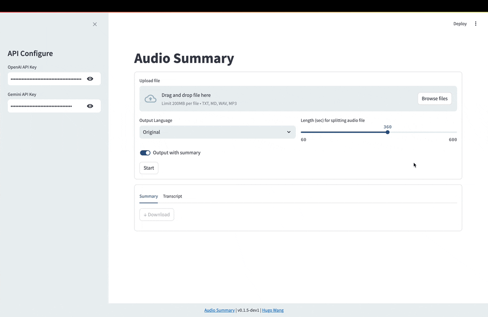

# audio-summary

**audio-summary** is a command-line tool designed to create meeting minutes from an audio recording, leveraging **OpenAI Whisper** for transcription and **Google Gemini** for summarization. Currently, only an online version is available, with plans for an offline version utilizing `Ollama` and `HuggingFace` under development.  
**Demo**

## Dependencies
Ensure you have `ffmpeg` installed:
```bash
# Mac
brew install ffmpeg

# Windows 
# 至ffmpeg 官網下載安裝: https://ffmpeg.org 
```

## Installation 
```shell
# Git
git clone https://github.com/thisishugow/audio-summary.git
# pip
pip install ./audio_summary.whl
```

## Configuration
Create `.env` file and setup `OpenAI API Key` and `Gemini API Key`
```shell
OPENAI_API_KEY=your_OpenAI_API_key
GOOGLE_API_KEY=your_Google_API_key
```

## Usage 
- **Streamlit UI** 
    ```b
    python -m audio_summary.server
    ```
- **Use command line**
    ```shell
    python -m audio_summary -f meeting-recording.wav -s true
    ```
    **Options**:

    * `-h`, `--help`: Show help message and exit.  
    * `-f` FILE, `--file` FILE: Specify the path of the audio file.  
    * `-o`OUTPUT, `--output` OUTPUT: Specify the path of the output transcription.  
    * `-s` SUMMARIZE, `--summarize` SUMMARIZE: Specify whether to use Gemini for summarization (`true/false`). Default=`true`.  
    * `--lang` LANG let AI response in ["original", "en", "zh-tw"]. Default=`"original"`
    Then you will see the full transcription and the meeting minutes. 